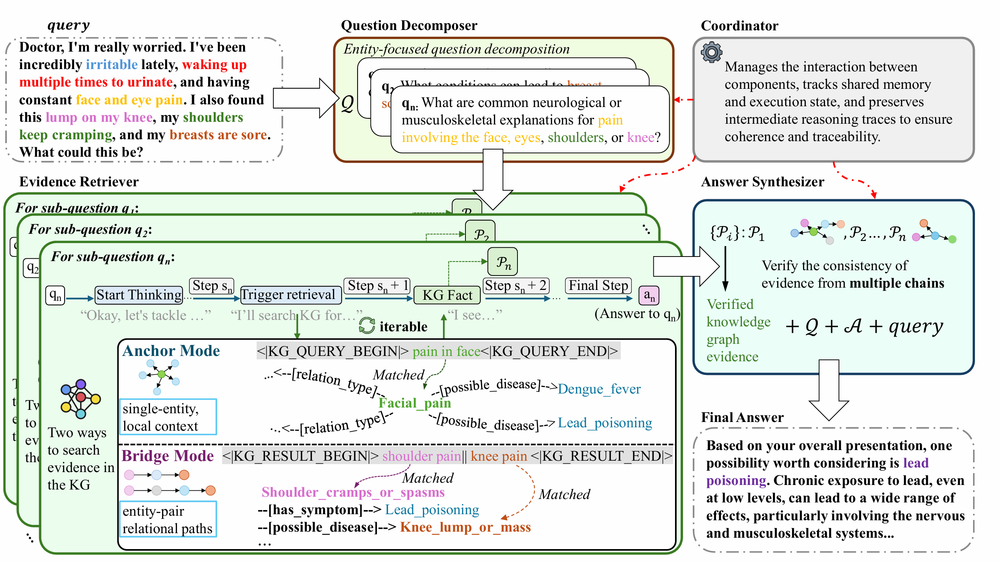

# MIRAGE

**Multi-chain Inference with Retrieval-Augmented Graph Exploration**

[](https://arxiv.org/abs/2508.18260)
[](https://www.python.org/downloads/)
[](https://aaai.org/)

## Overview

**MIRAGE** (Multi-chain Inference with Retrieval-Augmented Graph Exploration) is a test-time scalable reasoning framework for medical question-answering. Unlike traditional single-chain approaches that can lead to error accumulation, MIRAGE performs dynamic multi-chain inference over structured medical knowledge graphs.

This paper has been accepted by AAAI'26.

## Architecture



## Project Structure

```
MIRAGE/
├── config.py                      # Configuration management
├── build_kg.py                    # Knowledge graph builder
├── run_multiagent.py              # Main entry point
├── requirements.txt               # Python dependencies
├── data                           # Datasets
└── src/
    ├── mirage/                   # Core reasoning modules
    │   ├── coordinator.py        # Multi-agent workflow coordinator
    │   ├── question_analyzer.py  # Question decomposer
    │   ├── retrieval_agent.py    # Evidence retrieval agent
    │   ├── graph_retriever.py    # Knowledge graph interface
    │   ├── synthesizer.py        # Answer synthesizer
    │   ├── agent_state.py        # State management
    │   └── prompts.py            # Prompt templates
    └── kg_builder/               # Knowledge graph construction
        └── builder.py
```

## Installation

```bash
# Clone the repository
git clone https://github.com/Despacitobei/MIRAGE.git
cd MIRAGE

# Install dependencies
pip install -r requirements.txt
```

## Configuration

Before running the system, configure model paths, Neo4j connection, and other settings in `config.py`.

## Quick Start

### Step 1: Build Knowledge Graph

After configuring `config.py`, build the Neo4j knowledge graph from your triples file:

```bash
python build_kg.py
```

### Step 2: Run Inference

**Single Question:**
```bash
python run_multiagent.py --mode single --question "Your medical question here."
```

**Batch Processing:**
```bash
python run_multiagent.py --mode batch --dataset path/to/your/dataset.json
```

## Citation

If you use MIRAGE in your research, please cite:

```bibtex
@misc{wei2025miragescalingtesttimeinference,
      title={MIRAGE: Scaling Test-Time Inference with Parallel Graph-Retrieval-Augmented Reasoning Chains}, 
      author={Kaiwen Wei and Rui Shan and Dongsheng Zou and Jianzhong Yang and Bi Zhao and Junnan Zhu and Jiang Zhong},
      year={2025},
      eprint={2508.18260},
      archivePrefix={arXiv},
      primaryClass={cs.CL},
      url={https://arxiv.org/abs/2508.18260}, 
}
```
